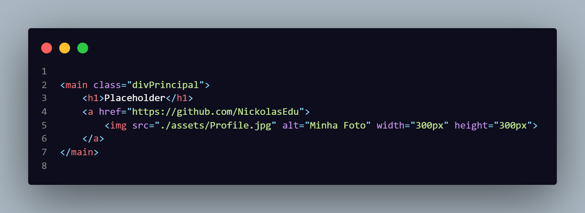
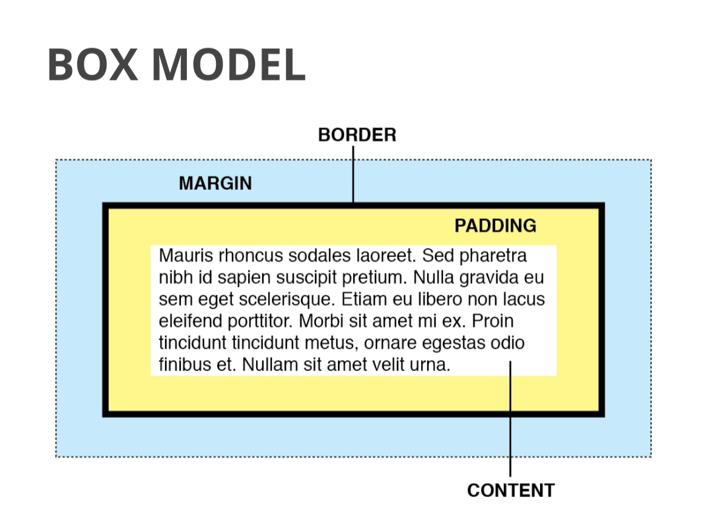
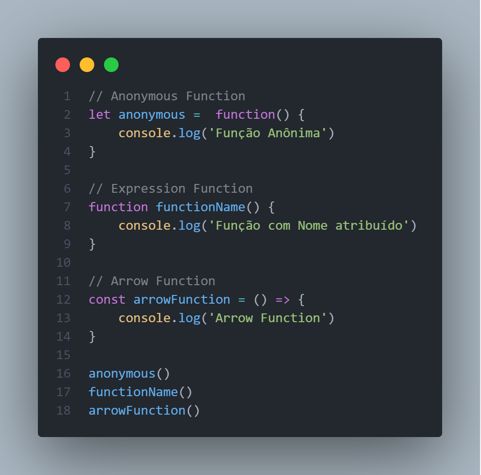
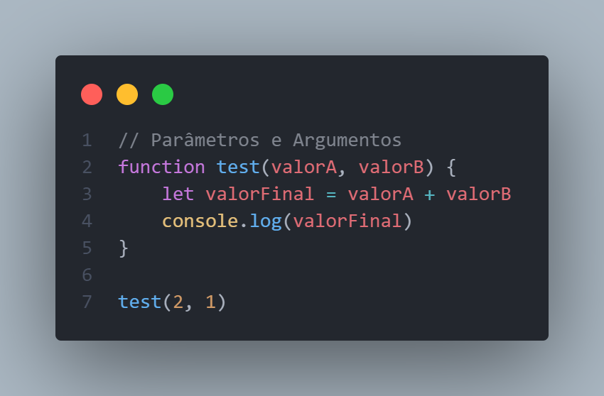
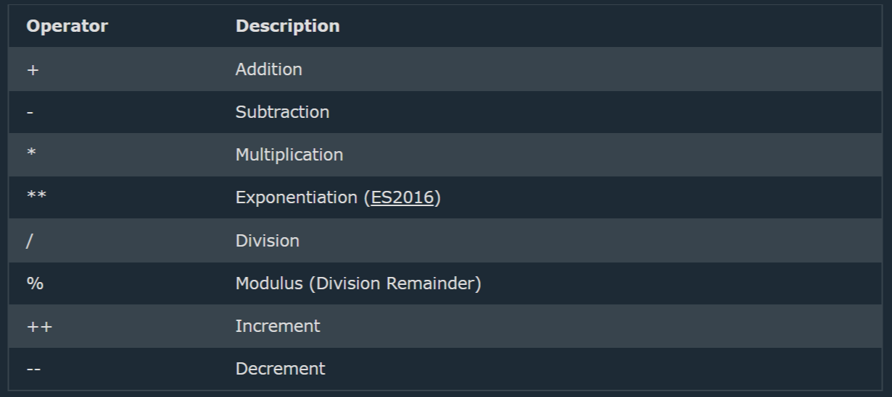
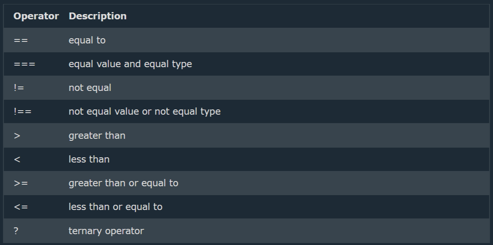
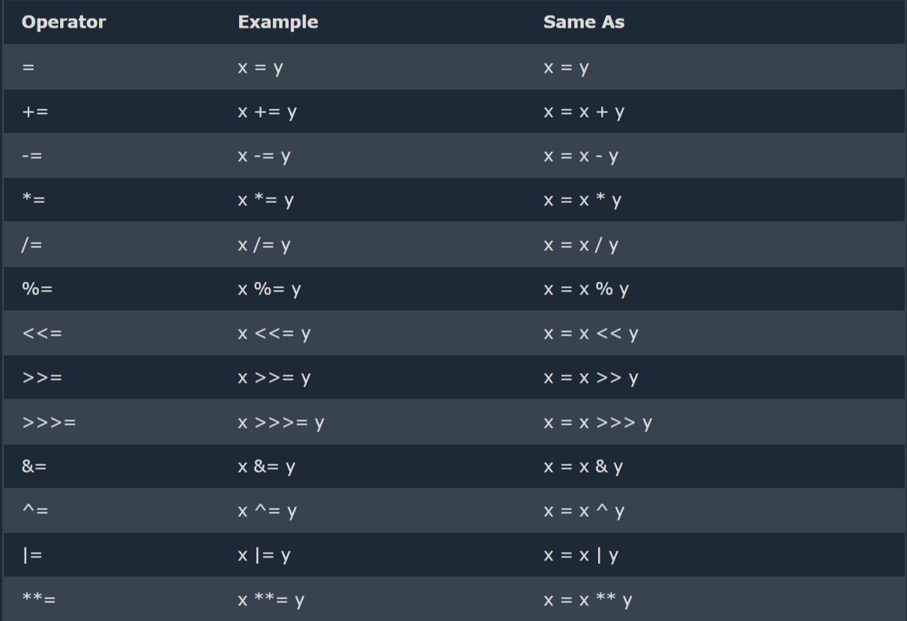
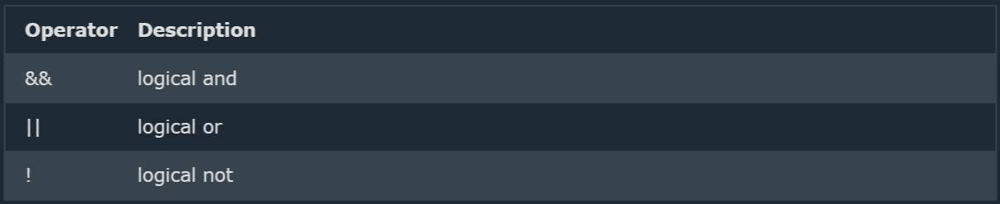

Prazer meu nome é Nickolas Eduardo, eu criei este repositório como uma forma de revisar todos os conteúdos que eu estudei relacionados a desenvolvimento web. De inicio eu fiz esses resumos para uso próprio, mas com o tempo conhecendo outros desenvolvedores iniciantes eu cheguei a conclusão de que esses meus resumos poderiam de alguma forma serem úteis para outros desenvolvedores.

Eu não sou nenhum desenvolvedor Pleno ou Sênior, ainda não sou nem um Júnior. Mas eu sei como é difícil no começo encontrar um norte, sendo assim eu espero que esse projeto ajude e seja útil para aqueles que estiverem lendo.

*”Deveria ser nosso dever espalhar o conhecimento, pois assim quando alguém chegar aonde eu  já estive antes, ele terá mais ferramentas para poder fazer melhor do que eu fiz”*

   **Kevin Hart**

## Index

0. [Inglês](#ingles)
1. [Conceitos web](#conceitos-web)
2. [Programação](#programação)
3. [HTML](#html)
4. [CSS](#css)
5. [Javascript](#javascript)

# Ingles

*Antes de abordar o tema principal, eu queria falar primeiro um pouco sobre a insegurança de muitos, a língua inglesa. Aqui acionarei alguns materiais de apoio para quem tiver o interesse de se aprofundar nessa questão.* <br>
*Ao longo do artigo eu sempre tentarei deixar materiais extras como sites, tutoriais, vídeos e tudo que de alguma forma agregue ao conteúdo que estiver aqui, assim esse projeto não se torna apenas um material de apoio com intuito de usar como revisão, mas que ajude a te abrir novos caminhos e conhecer novos conteúdos para aprender ainda mais.*

**Eu preciso comprar um curso de inglês para poder estudar programação?** <br><br>
NÃO, pelo menos não para começar. Ter inglês hoje é um diferencial para quase toda vaga de emprego, na programação não é diferente e eu vejo isso como uma vantagem para quem estuda na área. <br>
Por que vantagem? Pelo motivo de que nós acabamos tento contato diário com as linguagens de programação que foram escritas em inglês, então de antemão já somos introduzidos a conceitos de inglês sem nem percebermos. <br>
Se você tem tempo e pode investir em um curso de inglês, compre a vontade que vai te ajudar muito. Mas caso esse não seja seu caso, vou trazer algumas dicas para te ajudar a estudar o inglês mesmo que de forma passiva.

## Material de Apoio
- Mude o idioma do seu celular. Nós conhecemos muito bem nosso próprio smartphone, ao alterar o idioma você vai se acostumar ao tempo todo estar lendo em inglês, e de inicío será intuitivo já que você mesmo não sabendo nada de inglês, mas ao menos vai lembrar de o que aquele menu do aplicativo dizia quando estava em português e assim já irá começar a associar algumas palavras.
- Aplicativo Duolingo para praticar, esse app não te ensina o inglês mas vai te ajudar ainda mais ao associar as palavras trazendo uma linha de aprendizado evolutiva.
- Assistir séries e filmes legendados, se não temos tempo para fazer fazer um curso de inglês, então a saída é estudar sempre que possível. Assistir filmes ajudará ainda mais a fixar palavras, mesmo poucas que conheça, em diálogos e contextos de história.
- Ouça músicas lendo a letra em inglês, veja a traduçã, depois leia novamente em inglês, e no processo anote as palavras que não conhece e vá pesquisando cada uma.
- **Inglês do Zero Podcast**, esse podcast tem vários séries de episódios diferentes, desde de explicações linguísticas, inglês com música e cenas, diálogos e mais. Infelizmente ele foi descontinuado, mas tem mais de 200 aulas disponivéis lá no <a href='https://open.spotify.com/episode/7j9Tq3K6XO9QDo3XntEQRe'>Spotify</a>.
- Repita tudo de novo e encontre outras maneiras de continuar praticando, é com a prática que vamos associando e fixando os estudos, é por este motivo que sem um professor, eu recomendo trazer o inglês de forma passiva (séries/filmes), idioma do celular, etc. Pois assim faz o nosso contato com a língua algo diário.


# Conceitos Web

*Para se tornar um desenvolvedor web, antes de tudo, devemos entender um pouco sobre o que é a Web. Nesse capítulo eu trouxe algumas definições sobre como a internet funciona. **Mas é importante ressaltar,** que não é necessário decorar tudo o que estiver aqui, a intenção desse artigo como um todo é de que seja um material de apoio para estudos. Sendo assim, aqui nesse capítulo irei trazer alguns conceitos que se tornarão familiares para o desenvolvedor com o tempo, ao decorrer da sua trajetória de estudos quando algum desses termos ou outro semelhante aparecer na sua frente, o conteúdo aqui já servirá como base para fixar os conceitos e revisão para cada vez que estiver com alguma dúvida*.

## A Internet

A explicação mais simples do conceito de internet, é que ela é uma conexão global de computadores. Ao conectar dois ou mais computadores dentro de um mesmo espaço, você tem uma rede interna, do qual pode se conectar com outros computadores ou outras redes internas. Daí vem o nome Internet, de inter-network. O acesso a redes externas é feito entre a conexão da sua rede e uma outra rede de computadores muito maior, neste caso o seu provedor de Internet.

Estes computadores interligados, estão recebendo e enviando dados durante todo o tempo. Partindo dos backbones, passando pelo seu provedor de internet e processando os dados por meio da tecnologia **TCP / IP**.

"Os backbones são um meio de centralização dos dados, servidores centrais que recebem e encaminham as informações. Como a tradução literal diz, são a espinha dorsal da internet" 

## Link URL

O URL (**Uniform Resource Locator) esse conceito é traduzido como** Localizador e Identificador de Recursos. Aqui, recursos são os endereços das aplicações web, os sites que desenvolvemos. Para fazer essa localização e comunicação entre os computadores, ele é integrado ao protocolo **HTTP**. Usando regras de comunicação do sistema para passar as informações

## **HTTPS – Hiper Text Transfer Protocol (Protocolo de Transferência de Hipertexto)**

Esse é o método básico de como os computadores conversam, chamado de Request-response (ou Request-Reply), são os protocolos de requisitos feitos entre os computadores e servidores para qual e como os dados serão trafegados.

Basicamente é um conjunto de recursos que tem como função fazer a conversa do PC do client converse de forma segura, rápida e otimizada com o **IP** dos servidores.

## **IP - Internet Protocol**

O Internet Protocol, mais conhecido como **IP**, nada mais é o endereço de cada computador, como um número de CEP ou CPF. Quando você baixa uma foto, vídeo ou carrega um site, esses dados são divididos em partes, nesses dados são registrados o endereço de **IP** do seu dispositivo, e do dispositivo em que estes dados estão armazenados.

Como se você enviasse uma cadeira desmontada, mas cada parte dela você enviasse em pacotes separadamente pelo correio, e junto destas informações você envia um guia informando em quantas partes a cadeira está dividida e como ela deve ser montada, sendo esse sendo o trabalho do **TCP**.  A  diferença, claro, é que com a Internet de hoje, o envio de dados é feito de forma praticamente instantânea, por conta dos milhões de computadores interconectados.

## **TCP - Transmission Control Protocol**

Após os dados serem divididos, e terem sido registrados com os **IP's** de destinatário e remetente, essa informação navega desde o servidor alocado, navegando pelos cabos submarinos de internet, roteadores e todos os tipos de conexão, até encontrarem o dispositivo de destino.

Quando a informação chega é o **TCP** (Transmission Control Protocol) que irá organizar e conferir se não há nenhum dado faltando, caso isso ocorra ele reenvia o pedido para o **IP** inicial, para o reenvio deste dado específico.

Se essa informação sobre número de **IP**, servidores e banco de dados pode parecer confusa, é porque realmente é. Por esse motivo que existe o **DNS**.

## **DNS - Domain Name System**

Esse é o sistema que dá nome aos **IP's**, basicamente o conhecido "WWW" Com esse sistema , facilita nossa vida ao pesquisarmos algum site, e também facilitando a transmissão de dados, pois se em um computador usado como um servidor de dado que armazena vários domínios, seria muito mais complicado encontrar o site requisitado dentro daquele **IP**.

## Proxy

Proxy nada mais é que os meios que esses dados vão de um lado para outro, seja roteadores, cabos de fibra ótica, modens, outros computadores. Todos de alguma forma interligados, a todo momento recebendo informações endereçadas seja do Cliente para o servidor ou vice-versa.

## Client vs Server

Client se refere ao computador do usuário (como o seu no caso) o Servidor é um computador ou uma rede especifica onde existe alguma informação armazenada e para ser exibida na máquina do usuário, é necessário criar uma comunicação. Onde o **Client** fará um pedido/request para o servidor, o **Server** irá consultar se essa informação existe, e se caso ele tenha armazenado o que foi pedido, o servidor fará o Response mandando a informação de volta para o computador do usuário do lado do **Client**.

## Explicação prática

Vamos usar o funcionamento do YouTube como exemplo, você abre a plataforma pelo seu navegador e usa a barra de pesquisa para procurar um vídeo ou canal pelo nome.

Até aqui o que ocorreu foi: Você pediu para o seu computador procurar informações sobre o site do YouTube, que te respondeu enviando de volta a página de inicio deles (a página **home**), logo depois usou o **input** de dados para procurar um vídeo/canal pelo  nome.

Aqui seu computador mandou outro **Request** para os servidores do Youtube, que buscaram todas informações que são compatíveis com aquilo que você enviou na barra de pesquisa e fez o **Response** para o **Client,** enviando todas essas informações pelo processo que falamos acima.

## Browser

E no final das contas, após toda essa troca de informações e comunicação em máquina e servidor. É o navegador que irá fazer a interpretação de todo o código que foi recebido vindo do servidor (html, css, javascript, imagens etc...).

## Aplicação Estática vs SPA

Um site estático é quando ele enviar para o navegador tudo de uma vez, para ver algum conteúdo atualizado é preciso recarregar a página (dar um F5). Uma SPA - Single Page Aplication (Aplicação de uma página só) é quando a página vai trazendo as informações conforme você vai requisitando, exemplo o Facebook que na página inicial existe dados de Feed, stories, chat que são carregados de forma simultanea. 

Agora a função de fazer que isso funcione, cabe o programador que seguindo algumas séries de regras criará e desenvolverá a comunicação entre Sites, Dispositivos e APIs.


**[⬆ voltar ao topo](#index)**

# Programação

## Linguagem de programação

Os computadores não falam a mesma íngua que nós, basicamente eles entendem linguagem binária, aqueles clássicos zeros e uns (010101) que estamos acostumados a ver em filmes. As linguagens de programação é a maneira que foi criada para que nós possamos passar instruções para ser interpretadas pelos computadores.

Daí que vem os termos **Algoritmo** e **Lógica de Programação**, que resumidamente são: Um conjunto de comandos que façam sentido juntos, e encontrar maneiras de fazer com que todos eles se entendam sem prejudicar o funcionamento da aplicação, os já conhecidos **Bugs**.

Se até aqui esses conceitos não ficaram claros, pode ficar tranquilo pois eles serão melhor aprofundados com o decorrer e você logo se acostumará e se tornará intimo desses termos (principalmente com os **Bugs)**

Mas já vou aproveitar para dar um exemplo simplificado.

Pense na ação de lavar a louça e imagine de que forma você escreveria um passo a passo de como ela deve ser lavada. Se pensar muito ou perguntar para alguma outra pessoa, chegará a conclusão de que existem várias maneiras de se lavar a louça. Uns preferem lavar primeiro os pratos, outros já gostam de deixa-los para o final. Isso não importa muito aqui, a questão é: pensando no processo como um todo, o ideal será que você encontre uma maneira prática de fazer isso.

Se você usando alguma forma de comando mande um computador ensaboar e enxaguar copos, colheres e pratos separadamente e um por vês, será uma maneira de fazer. Mas se nesse meio tempo não houver um comando mandando ele desligar a torneira enquanto ensaboa outro item, apesar da tarefa ser concluída, ele terá gastado muita água no processo.

O que ocorre é **existem muitas maneiras se se escrever códigos e desenvolver sistemas, e com o tempo você irá aprender boas práticas. Como iniciante não deve se preocupar com isso agora, mas o que eu quero dizer é que, as vezes nós não sabemos se o que fazemos está certo ou não, então por agora tente focar em aprender o básico que a evolução e a autocrítica virão naturalmente com o tempo**.

## IDE's - Integrated Development Environment (Ambientes de Desenvolvimento Integrado)

Esses são os editores de código, a ferramenta fundamental do programador.

Para o desenvolvimento Web o melhor recomendado é o Visual Studio Code.

Também temos outras opções como Sublime Text e Atom, mas em questão de funcionalidades e performance, o VS Code tem vantagem entre os dois.

## Ambiente de desenvolvimento

*Um ambiente de desenvolvimento é tudo aquilo que te auxilia a ser mais produtivo. Para esse ínicio vou apresentar algumas ferramentas e extensões do VS Code que nos ajudam.*<br>
- **Tema do editor**, a escolha de um tema pode ser muito útil no começo pois ao se acostumar com uma paleta de cores, você logo vai encontrar os elementos na tela só de bater o olho, ajudando muito a diferenciar funções, variaveis e constantes.
- **HTML Preview**, ele te trás uma pré visualização numa janela ao lado do próprio código, bastante simples mas ajuda a você ver como o HTML está sendo apresentado, no inicio pode ser útil para pegar o comportamento das Tags.
- **Live Server**, esse sim é mais completo que o HTML Peview. O Live Server roda seu arquino direto no navegador e a cada vez que salva você pode ver com qual cara seu site está ficando de maneira semi-automática
- **Codesnap**, Uma situação muito comum quando um dev precisa compartilhar um código que não está no GitHub ou precisa achar um erro em uma parte especifíca. O Codesnap é essencial para isso, essa extenção tira um print em ótima qualidade do trecho do código que você escolher, já importa para imagem pronta para ser enviada para outro dev.
- **Dev Tools**, ou ferramente do desenvolvedor que abrimos pelo próprio navegador. Com ela conseguimos ver dados do código fonte, Estilos, consultas ao servidor de quase qualquer site que visitamos, e principalmente para estudarmos o comportamento dos nossos próprios projetos.


**[⬆ voltar ao topo](#index)**


# HTML

### Material de apoio do capítulo

Playlist com instalação do VS Code e primeiros passos HTML
<br>
<a href="https://www.youtube.com/playlist?list=PLmPm9dwop78-WqqusnExiNlRJVHEwZjWQ" target="_blank"></a>
<br>
Dois sites com documentação das tecnologias trabalhadas, muito úteis para relembrar maneiras de uso e revisar syntax de elementos.
<a href="https://developer.mozilla.org/en-US/">MDN Web Docs</a> e <a href="https://www.w3schools.com/">W3Schools</a>

## Definição
A sigla de HTML significa HyperText MArkup Language. Aqui já sabemos que o **https** é o protocolo de transferência de hipertexto, pois bem, o **HTML** é basicamente o arquivo de texto que o protocolo envia de um computador para outro.

Pense no **HTML** como um texto, a diferença é que nesse texto podemos adicionar a ele outros arquivos como de imagens, vídeos, cores, etc. Então é nele que vamos escrever a maior parte do conteúdo por meio de tags e classes e posteriormente agregar com outros tipos de arquivo.

**Qual a diferença de HTML para HTML5**

O **5** se refere apenas a qual versão que o programa está.

O HTML4 (comumente referido apenas como “HTML”) foi publicado em 1999, enquanto que a maior e mais recente atualização foi lançada em 2014. Chamada de HTML5, a atualização introduziu diversos novos recursos à linguagem.

O HTML5 introduziu algumas melhorias de semântica. As novas tags semânticas informam ao navegador sobre o significado do conteúdo, ajudando na sua interpretação.

## Tags HTML

As tags são usadas para informar ao navegador a estrutura do site. Ou seja: quando se escreve um código em HTML, as tags serão interpretadas pelo navegador, produzindo assim a estrutura e o conteúdo visual da página.

A principal característica das tags é estarem sempre dentro dos sinais de chevron (sinal de “maior que” e “menor que”).

Para o auxílio do entendimento das tags, criei um exemplo prático em um arquivo **HTML**. Esse arquivo está disponível para ser clonado, navegar pelo código ou até para ser copiado amnualmente e ir acompanhando visualmente a apresentação das tags, seja no navegador com live server ou pelo HTML Preview.


<a href="https://github.com/NickolasEdu/html-guide" target="_blank"></a>

Ao navegar pelo código de exemplo, notamos que: Tudo dentro da tag 'head' é referente a configuração, encaixe na tela, título da aba, ícone da janela, importação de fonte, importação de CSS, é a cabeça do nosso sitema. Já no 'body' vai literalmente o corpo, todo o conteúdo visivél para o usuário. <br>
Até aqui fomos introduzidos as tags e as divs, que são basicamente caixas que agrupam certos conteúdos. Div 'header' por exemplo agrupa todas as tags que estão no cabeçalho da página. E que cada div pode receber uma classe. <br>

**Esclarecimento de conceitos**<br>
**Semântica:** A forma que as ferramentas de busca dos navegadores irão ler a nossa página. Assim como uma redação precisa ser clara e bem escrita, nosso código também, tanto para quem for ler as linhas que escrevemos, como o navegador para buscar esses informações. A semântica é essencial para o SEO - Search Engine Optimization (Otimização para motores de busca).<br>
**Indentação:** Essa é ação de afastar o texto da margem, de forma que fique alinhado com as tags que o agrupa. Sempre devemos identar com a tecla tab, nunca com a barra de espaço.<br>
**Hierarquia de Tags:** com o tempo vamos começar a falar sobre elementos pais e filhos. Um elemento pai é quando uma tag ou div agrupa outras tags dentro dela, tags irmãs são as tags dentro do mesmo alinhamento quando estão agrupadas.<br>


Bora entender o funcionamento aqui <br>
A tag Main é o elemento pai agrupando outros elementos dentro dela;<br>
H1 e a tag Ancora são elementos irmãos, pois estão no mesmo nível de identação;<br>
img aqui é a tag filha da ancora;<br>
O comportamento desse código consiste em uma imagem que ao ser clicada leva o úsuario para outra página, a do link que foi passado pelas propriedades.<br>

*(Caso esteja no mobile, abra a imagem)*

<br>

**Propriedades**<br>
**href=""**, Referência de hiperlink. Propriedade que é passada um link de destino.<br>
**src=""**, System Reference Code, um caminho que indica um conteúdo, no caso uma imagem.<br>
**alt=""**, Texto alternativo para caso a imagem não seja carregada, fica como segunda opção de exibição.<br>
**width/height**, parâmetros de largura de altura atribuídos a imagem.

## Formulários
São sessões de captação e controle de dados iseridos pelo usuário, quem recebe esses dados são os **inputs**
<br>
Mas o que são Inputs?
<br>

<dl>
  <dt>Inputs e Outputs</dt>
  <dd>
   São termos de programação referentes a entradas e saídas de dados. Como por exemplo uma página de cadastro, onde os inputs vão receber os dados de nome, email e outros tipos de informação. Para estabelecer uma base melhor - e também uma indicação de estudo passivo - vou deixer o link de uma com os inputs que mais usamos.
  </dd>
</dl>

[Lista de Inputs](https://www.instagram.com/p/CZ7WyHKFO3e/?utm_medium=copy_link)


<dl>
  <dt>Form</dt>
  <dd>
  Os formulários são colocados dentro de uma div específica, a Form, que nesse caso o uso não é apenas semântico mas também pelo uso de funcionalidades. A div Form oferece a possibilidade do uso de alguns parâmetros para manipulação dos dados..
  </dd>
</dl>

action="" - aqui é passado para qual o endereço os dados serão enviados, se esse parâmetro não for definido, por padrão será enviado para a própria página onde está o formulário.
<br>
method - voltando a falar sobre o http, já sabemos que ele é o protocolo de comunicação de sistemas, pois bem, com essa propriedade podemos definir o método de envio dos arquivos.
<br>
POST vs GET - Quando trabalhamos com dados, o método indicado de se usar é o **POST**, pois ele oculta os dados na hora de fazer o envio. Já pelo método **GET** isso não acontece, um exemplo é a pesquisa do Google, ao buscar algo pelo navegador nós vamos ver no **URL** em meio a diversos caracteres especiais, as palavras chaves que colocamos no input de pesquisa. Essa é a forma de envio do método **GET**.
<br>


<dl>
  <dt>Fieldset</dt>
  <dd>
    Cada página só pode conter uma tag Form, mas para dividirmos certos tipos de dados (cadastro pessoal, cadastro profissional) podemos usar a tag Fieldset. Passando os valores de cada campo por um ID. Assim como podemos passar um título com tags h1-6 para parágrafos, os Fieldsets também podem receber títulos por meio da tag legend.
  </dd>
</dl>


<dl>
  <dt>Button</dt>
  <dd>
    É possível criar um botão pela propriedade 'input type="button"' mas o mais comum é usar pelo formato de tag button mesmo, sempre que um formulário tiver um button ele será do tipo submit, mas podemos alterar esse tipo como para reset, por exemplo.
  </dd>
</dl>


<dl>
  <dt>Datalist</dt>
  <dd>
  Abre uma aba de opções pré definidas, e é escrita como uma tag de lista. Datalist é a tag pai, cada item fica dentro de uma tag option e que podem ser filtradas e colocadas como tags filhas de alguma optiongroup.
  </dd>
</dl>

## Introdução ao CSS

<dl>
  <dt>Inline vs Block</dt>
  <dd>
    Vamos considerar que tudo na nossa página será dividido em caixas - como no exemplo das Divs - e que elas terão propriedades de exibição, ou seja, nós colocamos conteúdos dentro dessas caixas que dependendo das tags, nós veremos diferentes comportamentos de como são mostradas na tela.
  </dd>
</dl>

Então antes de aprender sobre manipular essas propriedades através do CSS, vamos entender um pouco de como são o comportamento padrão destas caixas.

<dl>
  <dt>Display: block</dt>
  <dd>
  Nome referente a blocos, cada conteúdo com a propriedade block será alihado um em cima do outro, como se estivesse sendo alinhado numa coluna. Com elementos Block você pode alterar seu tamanho (width/height) e as propriedades de margin, padding e border.
<br>
exemplos: p, h1-h6, ul, divs (div, section, footer).
  </dd>
</dl>

<dl>
  <dt>Dislay: Inline</dt>
  <dd>
  Propriedade que alinha os elementos em linha, porém seu tamanho não pode ser alterado, apenas as distâncias de margin, padding e border.
<br>
exemplos: a, span, strong, img.
  </dd>
</dl>

<dl>
  <dt>Display: inline-block</dt>
  <dd>
  O conteúdo continua em linha, mas agora seu tamanho pode ser alterado. Uma junção das duas propriedades de display, dando mais liberdade para manipulação.
  </dd>
</dl>

## Box Model
**Mas afinal, o que são padding, margin e border?**
Se todos os elementos pocisionados na tela são como caixar, o **Box Model** são as propriedades que englobam a caixa.
<br>

<br>
Legenda:
- Margin é o espaço ao redor da caixa
- Border é a borda ao redor da caixa
- Padding é o espaço interno da caixa
- Por fim, o conteúdo exibido na tela.

<p>
  **Na prática**, margin é uma forma de definir uma distância entre um elemento e outro, um texto de uma imagem por exemplo. O Padding é usado para definir o tamanho da caixa onde ficará o conteúdo, pode ser um botão, um background com cor diferente. Border é caso o que separa o espcaçamento externo do interno (margin do    padding). Tudo isso é manipulável a partir do CSS, porém existe um detalhe que devemos nos atentar.
</p>

<p>
  Esses valores do **Box Model** já tem propriedades pré definidas pelo sistema, então ao manipular eu posso adicionar um valor de 10 pixels a margem e 5 de padding, mas esses valores ainda serão somados ao border que eu nem coloquei. Sendo assim para evitar esses problema, é usada a propriedade **Box-sizing**, que serve para unificar os valores das nossas caixas de conteúdos.
</p>
<p>
  Essas podem ser informações ainda abstratas, mas ao decorrer do estudo de CSS tudo isso fará mais sentido. O intuito dessa introdução é como no capítulo sobre internet, falar sobre conceitos básicos que vão nos ajudar ao entendimento global dos outros conceitos.
</p>

**[⬆ voltar ao topo](#index)**

# CSS
**Cascading Style Sheet - Folha de Estilo em Cascatas**
É o arquivo que define o estilo de tudo aquilo que roda no client. Onde você altera como vemos a tela, os título, parágrafos, com espaçamentos, color, posicionamento etc. Cascading Style Sheet, é chamado assim por definir os estilos do conteúdo html aparecerá na tela, e o código CSS é escrito em forma de cascata, manipulando os elementos de cima até o final da página, numa ordem “decrescente”, ou em descida.

## Material de Apoio
[Playlist de primeiros passos no CSS](https://www.youtube.com/watch?v=oSJgsGbmK4c&list=PLmPm9dwop78_WRFefS3xtQ--NlpmZiTer)

## Tipos
Existem 3 maneiras de estilizarmos o nosso arquivo HTML através do CSS, que são:

<dl>
  <dt>CSS Inline</dt>
  <dd>O formato inline é passando os estilos como propriedades dentro de uma tag como 'style=""', esse modelo não é nada prático tanto para escrever como parar dar manuntenção.</dd>
</dl>


<dl>
  <dt>Tag Style</dt>
  <dd>A tag Style é colocada dentro do Head e funciona perfeitamente, recomendada para testes simples caso não prefira fazer através do DevTools ou até para páginas estáticas de um carregamento só, ou seja, todo o conteúdo da página está ali e não á nenhum tipo de navegação para outras páginas, pois a tag Style faz as maniupalções de estilo apenas na página no qual foi declarada.</dd>
</dl>


<dl>
  <dt>Import do arquivo CSS</dt>
  <dd>A melhor prática é a importação de um arquivo CSS. Essa importação é feita na tag head com uma tag de link indicando o caminho até o arquivo CSS com 'href="arquivo.css"'.</dd>
</dl>

*A sintaxe CSS recebe um seletor, uma propriedade e um valor*


# Seletores
Os seletores tem diferentes niveis de força e permitem combinações para especificar qual elemento deve ser estilizados.
- Seletor '*' é um seletor de menor nível, ele será responsavél por passar um valor que será aplicado em todos os elementos, até que estes recebam um novo estilo a partir de outro seletor. É majoritariamente usado para zerar as propriedades padrão dos próprios elementos, como **margin**, **border** e **box-sinzing**
- Selecionar por tags, o próximo nível de força são as tags, é possivél decidir os estilos que uma tag específica terá sempre que aparecer.
- Classes e ID's, mais fortes que as tags, é mais recomendado pois dentro de diferentes classes nós podemos ter tags semelhantes que serão atribuídas a diferentes estilos
- Combinadores são as formas de combinar seletores, podendo passar um esmo estilo para diferentes seletores colocando entre vírgulas, como; "p, .classe" ou atribuir a um elemento filho específico dentro de outra tag, como; ".class ul li a".

Cada seletor tem uma força, que faz com que exista uma pirâmide de força onde um seletor se sobrepõe ao outro. Segue um exemplo das forças de seletores, sendo quanto maior o número, maior a força.

<ol>
  <li>Seletor universal '*' e pseudo classes</li>
  <li>Seletores de elemento e combinadores</li>
  <li>pseudo elementos</li>
  <li>classes e propriedades de tag</li>
  <li>Seletor de ID</li>
  <li>CSS Inline</li>
 </ol>

## Pseudo elementos
[Lista de pseudo elementos](https://developer.mozilla.org/en-US/docs/Web/CSS/Pseudo-elements)

## Cores Web
Todas as cores na internet são definidas por variações de valores das cores azul, vermelha e verde. Ao atribuir um elemento alguma propriedade de cor, existem 3 tipos de valores, com mais um bônus.

<dl>
  <dt>RGB</dt>
    <dd>
      Sigla para as iniciais das cores web Red, Green, Blue. Sua sintaxe recebe 3 valores de 0 até 255, cada valor se refere a uma das três cores e resulta numa combinação entre elas. ex: rgb(0, 123, 255). Também á uma variação com o rgba, que recebe 4 valores sendo o último um valor de 0.1 até 0.9, que é referente a transparência da cor. O 'a' signifca alpha.
  </dd>
 </dl>
 
 <dl>
  <dt>HEX</dt>
  <dd>
    Tradução para cores Hexadecimais, o formato HEX nada mais é que um shorthand do rgb. A sintaxe é um valor em código com seis caracteres combinados entre letras e números seguintes de um '#', ex: #C1F4T7. Á quem prefira o formato rgb/rgba ao HEX, mas isso vai de gosto pessoal.
  </dd>
 </dl>
  
  
<dl>
  <dt>Nome</dt>
  <dd>
    A maneira mais simples é chamar a cor pelo nome em inglês, o CSS é capaz de reconhecer. Porém não é uma boa prática, pois dependendo do sitema ou navegador, pode causar algum erro. Porém existe uma maneira que nos possibilita nomear cores para usarmos no nosso código, são pelas variáveis.
    Quando precisamos passar uma cor em vários elementos diferentes do nosso CSS, para evitar a perda de tempo de sempre precisar pesquisar pelo seu valor rgb ou HEX, ao passar o valor para uma variável, nós agora podemos colocar nos elementos o nome da variável que criamos.
  </dd>
</dl>

## Elementos na tela

Manipulação da apresentação dos elementos na tela

**Display: none** - O elemento é praticamente removido, como se não existisse mais

**Visibility**: hidden - O elemento fica oculto, mas sua posição na tela continua preservada

**Opacity: 0.5** - Com valores entre 0 e 1, você altera a transparência do elemento na

**Elementos** **vazados** - Quando o elemento ocupa um tamanho maior que o definido

**Overflow:** Atributo para manipular elementos que não couberam na tela, fazendo um autoajuste

**hidden** - mostra apenas o conteúdo que não vazou

**Scroll** - Define uma barra de Scroll lateral.

**Scroll x/y** - aplicar a batera apenas horizontal ou vertical

**Auto**: Aplica uma barra padrão, baseada nos parâmetros do elemento

## Background

Conteúdo ao fundo de todos os elementos

**background-color:** que recebe algum parâmetro de cor;

**background-image:** para definir uma imagem com **url('imagem.jpg')**, que também pode receber o **background-repeate:** com 'no-repeate' ou 'repeate', para fazer que a imagem seja posicionada repetidas vezes para cobrir a tela, ou para previvir esse comportamento.

## Position

## Posicionamento
A posição padrão dos elementos na tela é **inline**, ou seja, ocupa a linha intera sendo um elemento colocado em baixo do outro.

 <dl>
  <dt>Relative</dt>
  <dd>
    Essa posição é relativa a alguém, desde o elemento pai, ao algum dos valores top, right, left, botton. Independente de ao que o elemento fica relativo, o CSS mantém o espaço da sua posição inicial como ocupado.
  </dd>
 </dl>
 
 
 <dl>
  <dt>Absolute</dt>
  <dd>
    Remove o padrão inline, e faz com que o elemento tenha a aparência de estar flutuando sob os outros elementos.
  </dd>
 </dl>
 
 
 <dl>
  <dt>Fixed</dt>
  <dd>
    O elemento ficará fixado sempre aparecendo na tela, acompanhando o scroll da página
  </dd>
 </dl>
 
 *Também existe a propriedade z-index, para controlar a camada - altura - de cada elemento que está flutuando na tela, isso se chama **element stack** quando tenho mais de um elemento flutuante e é necessário definir uma ordem entre eles*

## Tipografia
Não apenas com cores, mas as fontes e suas propriedades são fundamentais para passar alguma mensagem para o usuário. Importante lembrar que nem todos os tipos de fontes serão compatíveis com todas as propriedades.
<dl>
  <dt>Font-Family</dt>
  <dd>Nessa propriedade é passada uma série de fontes que estão relacionadas, para indicar ao sistema qual font usar e quais as opções caso a primeira não seja encontrada. Isso na programação é conhecido como **fallback**, como um válvula de escape que previde um possível erro.</dd>
</dl>

<dl>
  <dt>Fonts Web</dt>
  <dd>São maneiras de importar fontes para o seu projeto, para que sejam carregadas pelos navegadores do usuário. O método de import pode ser feito pelo **Google fonts** e colocado na tag de link dentro do head do arquivo.</dd>
</dl>


<dl>
  <dt>Font weight</dt>
  <dd>Prorpiedade para definir a expessura de uma fonte, desde palavras chaves como bold, bolder, light ou por números de 100 a 900</dd>
</dl>


<dl>
  <dt>font style</dt>
  <dd>Permite adcionar um estilo a mais nas fonts, como o *itálico*</dd>
</dl>


<dl>
  <dt>Font size</dt>
  <dd>Define o tamanho da fonte, recebe unidades de medida</dd>
</dl>


<dl>
  <dt>Font Variante</dt>
  <dd>Define estilos especificos, como por exemplo a propriedade de small caps. Todos os caracteres minúsculos ficam com o mesmo tamanho</dd>
</dl>


<dl>
  <dt>Font Stretch</dt>
  <dd>Permite opções de comprimento das fontes, recebe nomes chave como: expended, condensed, normal e valores entre 20% até 50%</dd>
</dl>


<dl>
  <dt>letter spacing / word spacing</dt>
  <dd>Respectivamente define espaço entre as palavras ou letras. Recebe valores entre 1.0 e 2.9</dd>
</dl>


<dl>
  <dt>Text Transform</dt>
  <dd>Define algum estilo especifico, como todas as primeiras letras das palavras em maiusculo. Recebe palavras chave como: uppercase, capitalize, lowercase</dd>
</dl>


<dl>
  <dt>text decoration</dt>
  <dd>Remove traçado de links, ou adiciona em textos normais. O traço pode ser aplicado debaixo das palavras, em cima no cortando no meio.</dd>
</dl>


<dl>
  <dt>text aling</dt>
  <dd>Essa é uma funcionalidade muito usada no Microsoft word por exemplo, de alinhar o texto para algum lado ou preenchendo a página, com: center, right, left ou jutify</dd>
</dl>


<dl>
  <dt>text shadow</dt>
  <dd>Aplica uma sobra ao texto.</dd>
</dl>

## Posicionamentos responsivos

### Flexbox vs Grid
Temos duas prorpriedades avançadas de layout do CSS, dois métodos que oferecem melhor controle sobre a distribuição dos items na tela. Porém é importante lembrar que, não é possível usar grid e flexbox no mesmo elemento, na mesma aplicação é possível, mas sempre atribuídos a diferentes objetos. A declaração de ambos é semelehante, passando o valor de Flexbox ou Grid para um elemento pai, e assim manipulando os elementos dentro dele.

### Flexbox
Ao ser atribuído a um elemento pai, nos permite controlar a orientação de todos os elementos dentro dessa caixa. Com as propriedades flex-direction, justify-content, align-items, flex-row. Segue um arquivo em pdf exemplificando as posições de cada elemento dentro de uma caixa para diferentes propriedades. [Lista Flexbox](./docs/Flexbox.pdf)

[Lista de exemplos](#Link)

### Grid

**[⬆ voltar ao topo](#index)**

# Javascript

## O Básico
No desenvolvimento web o **HTML** é a estrutura da página, o **CSS** é a forma que as elementos são apresentados e o **Javascript** é uma maneira de criar funcionalidades para a nossa aplicação. Numa explicação mais simples, o HTML é o corpo, CSS a aparência e o Javascript será o cérebro, esta linguagem é capaz de manipular todo o nosso site.

Criada em 1995 por Breandan Eich, o Javascript está em mais de 90% das páginas web na internet. Por mais que o nome seja semelhante, não devemos confundir com Java. Essa é uma liguangem diferente, lá em sua criação a sacada de usar o nome foi uma questão de marketing para popularizar o JS mais rápido, então juntaram o nome Java com Script (de roteiro) para alto explicar a linguagem que antes era  chamada de LiveScript.
<br>
E para os curiosos, o nome Java é em homenagem a uma ilha da Indonésia que era responsável pelo exportação do café que um grupo de programadores consumia quando criaram essa linguagem. Tanto que o simbolo do Java é uma xícara de café. Nesse caso, a única semelhança entre as linguagens é realmente o nome que foi usado como inspiração.
<br>
Javascript é uma linguagem muito abrangente, além de vários frameworks - como o React.js por exemplo - é possível também desenvover backend e suas branchs de desenvolvimento chegam até mesmo ao Typescript. Mas para introduzir aqui, vamos falar do Javascript no DOM.

## Fundamentos
Árvore de DOM - Document Object Model. Se baseia em todo o Javascript que roda no lado do cliente, é o documento que o navegador interpreta e no qual podemos manipular toda a estrutura do nosso site. O DOM é o que faz a ligação entre o Hyper Text com o JS.
<br>
Sabendo disso, então podemos concluir que tudo no HTML é elemento, tudo no CSS são caixas e tudo no Javascript é Objeto.
<br>
Como HTML e CSS o JS tem regras de uso que são muito importantes ficarmos atentos, visto que, por ser verdadeiramente uma linguagem de programação, como qualquer outra língua existem regras gramaticais para que possa ser entendida, isso na programação é chamado de Syntax - ou sintaxe. Assim como o CSS existe mais de uma maneira de fazer o link do seu arquivo index com o de javascript, mas é importante se atentar ao comportamento do sistema.
<br>
O CSS seja - interno ou externo - é sempre importado na parte de cima do index, pois assim o navegador ao fazer o carregamento dos elementos já terá carregado os seus estilos, evitando bugs visuais. Porém o comportamento do JS é diferente, ao encontrar um arquivo **script** no index o navegador vai automaticamente parar de carregar todo o resto até que termine de carregar o arquivo javascript, e isso com certeza vai travar o carregamento da aplicação. Então para previnir isso todo o script deve ser colocado logo acima da tag de fechamento do body, no final após todos os elementos HTML. Seguindo essa boa prática, no momento em que o navegador for carregar o aqrquivo JS, todo o resto já estará carregado, melhorando o desempenho do seu site.
<br>
O código javascript é linkado ao HTML pela tag script, de forma interna escrevendo todo o código entre a tag de abertuda e de fechamento - meio não recomendado, usado apenas para projetos simples e testes - ou passando a propriedade **src** com o caminho do seu arquivo.
Exemplo: ...

## Material de Apoio
[Intensivão Javascript](https://www.youtube.com/watch?v=i6Oi-YtXnAU)

## Statements
Os Statements são as instrunções de uso para passarmos comandos para o sistema.

<dl>
  <dt>Syntax</dt>
  <dd>Como já vimos, são as regras de escrita. Seriam as "vírgulas" e ascentos de um texto</dd>
</dl>

<dl>
  <dt>Palavras chave</dt>
  <dd>São palavras reservadas pelo sistema, então o uso delas não são recomendadas na maioria dos casos, pois quando escritas no interpretador ele pode não entender o comando que queremos passar. Alguns exemplos de palavras-chave: if, else, case, switch.</dd>
</dl>

<dl>
  <dt>Valores</dt>
  <dd>Para manipular a nossa aplicação será necessário muitas vezes receber, enviar e alterar dados dentro do nosso sistema, para isso existem maneiras de armazenar, manipular e trabalhar com esses valores.</dd>
</dl>

## Tipos de Dados

<dl>
  <dt>String</dt>
  <dd>Dado do tipo de texto, sempre entre aspas sendo elas 'simples' ou "completas". Porém é indicado manter um padrão e não ficar alternando dentro de um mesmo sistema, outra dica é o uso da aspas completa, pois evita problemas caso se depare com um texto em inglês que contenha palavras como "can't"</dd>
</dl>

<dl>
  <dt>Template String</dt>
  <dd>String literal é simplismente um texto entre dois sinais de crase - sim, aquele acima do é - que abre mais possibilidades de uso que veremos mais a frente</dd>
</dl>

<dl>
  <dt>Number</dt>
  <dd>Referente a qualquer tipo de número: 1, 45, 200, 1238, etc...</dd>
</dl>

<dl>
  <dt>Float Number</dt>
  <dd>São números quebrados: 1.8, 2.5, 4.9, etc...</dd>
</dl>

<dl>
  <dt>Booolean</dt>
  <dd>Os boleanos são valores de um ou outro que fica dividido entre true e false. Um boleano tem valor oposto do outro</dd>
</dl>

### Sem Dados

<dl>
  <dt>Undefined</dt>
  <dd>Foi declarado, mas não foi definido - nenhum valor atribuído</dd>
</dl>

<dl>
  <dt>null</dt>
  <dd>Foi declarado, foi atribuído mas não há nada dentro dele.</dd>
</dl>

<dl>
  <dt>NaN</dt>
  <dd>Not a Number ou não é um número, ocorre quando tentamos pegar o valor de alguma operação entre um número e outro tipo de dado.</dd>
</dl>

## Expressions
As expressões são toda as linhas de atribuição de valor, ou ação.

<dl>
  <dt>Variáveis</dt>
  <dd>
    Aonde armazenamos valores fixos ou não, para serem usados posteiormente no desenvolvimento do nosso algoritmo
  </dd>
</dl>


<dl>
  <dt>New</dt>
  <dd>
    Uma função construtora do próprio Javascript que serve para criar um novo objeto, ela recebe a função com o tipo de objeto que será criado [ex: string(), number(), date()] e os dados desse objeto, dentro dos parâmetros e entre aspas.
  </dd>
</dl>


<dl>
  <dt>Typeof</dt>
  <dd>
    Literalmente "Tipo de..." dá um feedback sobre qual o tipo de dado é aquele objeto.
  </dd>
</dl>

<dl>
  <dt>Delete</dt>
  <dd>
    Para deletar um dado especifíco, recebe a expressão que está armazenado e o objeto desejado. ex: Delete array.name, assim deletendo todos os valores de nome.
  </dd>
</dl>


## Variavéis
São são recipientes de valores, sejam eles de números, texto, elementos, funções. Podemos guardar valores dentro de variáveis enquanto declaramos elas com os nomes que melhor acharmos adequado para facilitar a reutilização. Porém como toda linguagem, precisamos entender as regras e o seu comportamento. Ao declarar uma variável temos as seguintes opções:

<dl>
  <dt>var</dt>
  <dd>Essa maneira de declarar variáveis foi descontinuada, pois ela tem um scopo global e pode ser sobreescrevida, causando bugs com seu uso.</dd>
</dl>

<dl>
  <dt>let</dt>
  <dd>Permite a reatribuição de valor, porém seu escopo é especifico e isso previne os bugs</dd>
</dl>

<dl>
  <dt>const</dt>
  <dd>Variável constante, ou seja: o seu valor será sempre fixo. Tem o escopo especifico porém seu valor não pode ser reatribuído</dd>
</dl>

### Escopo Global vs Especifico
O funcionamento de uma variável vai ser muito definida pelo escopo em qual foi declarada, o escopo global é no corpo comum do script, onde pode ser usada em qualquer outra parte do código. Escopo especifico ocorre quando declaramos uma variavel dentro de uma function e ela só irá existir ali dentro.

## Functions
As funções guardam comandos que só são executados quando chamados, sua syntax báscica consiste em **()** para indicar que aquilo é uma função, e agrupar tudo que será amarzenado dentro dela com **{}**, também existem diferentes maneiras de declarar uma função:

<dl>
  <dt>Anonymous function</dt>
  <dd>Uma função que não é nomeada - ou função anônima</dd>
</dl>

<dl>
  <dt>Expression function</dt>
  <dd>Uma função com um nome atribuído a ela</dd>
</dl>

<dl>
  <dt>Arrow Function</dt>
  <dd>Uma função passada dentro de uma constante e seu valor final é retornado para aquela variável. A Arrow Function é chamada assim pela a sua aparência, sendo declarada com os o sinal de '=>' além dos sinais de parênteses para indicar ao sistema que é uma função</dd>
</dl>

Exemplo:




### Return
Seu comportamento básico é parar a execução de uma função, veremos esse uso melhor com condicionais. Ou usar o **return** com um valor, esse valor será retornado para quem chamou a função. 

### Paramêtros e Argumentos
A Syntax das funções consiste em, usar '()' na declaração e na chamada da função. Para atrabalhar dados no escopo interno da função, sem depender de variáveis, é feito o uso dos argumentos e paramêtros. Os parâmetros são os nomes que passamos na declaração da função, os argumentos são os valores que serão atribuídos aos parâmetros

Ex:



### Hoisting
Como já sabemos, o javascript lê tudo de cima para baixo, então as funções sempre serão chamas na sequência em que foram escritas. Sendo assim, o hoisting serve para subir uma função - na tradução literal seria erguer - para alguma linha acima de onde ela foi declarada, isso faz com que o interpretador deixe de executar o quem em seguida, e vai primeiro atrás da função que você mandou chamar primeiro, depois disso que ele seguirá lendo e executando o resto do seu código. Porém devemos ficar atentos ao fato de que o hoisting não funciona com variáveis, elas precisam ser declaradas antes de serem chamadas, então devem estar em sequência no código, dessa forma o hoisting com Arrow Functions fica inviável.

## Síncrono vs Assíncrono
A execução do javascript é de maneira **síncrona**, que no caso é o comportamento padrão do interpretador, o código irá executar aquilo que lhe for apresentado na ordem do script. Nesse comportamento o sistema só vai carregar a próxima função depois que a atual estiver concluída.

Ou seja, o comportamento padrão é de executar na ordem em que foi escrito, mas isso pode ser manipulado ao escrever um código em que algumas partes serão assíncronas. Assim, podemos definir quais funções do nosso código terão um tempo de execução diferente do padrão. 

## Callback vs Promise
**Callback**

É quando uma função fica de chamar outra assim que for terminada sua execução, usada para quando uma função específica depende de outra para ser executada. Exemplo, um sistema que precisa receber um valor e depois exibir ele. Não é possível exibir um valor antes dele ser atribuído, então a primeira função vai ficar responsável por receber uma ação de dado e depois chamar a função que irá exibir os dados.

**Promisse**

As Promises são um método mais moderno que o de Callback, aqui a intenção de uso é praticamente a mesma, mas com comportamento diferente. Aqui a ideia também é chamar uma função depois que outra for executada, porém a próxima função será chamada referente a uma condição estabelecida, já que a promise deve ser retornada para alguém (variável ou função) e recebe dois parâmetros(resolve, reject) um em caso de condição concluída, outro em caso de condição não concluída.

## Exemplos
Síncrono

```javascript
function defaultFunction() {
  console.log('Ok, comportamento padrão')
}

defaultFunction()
```
Assíncrono com setTimeout() - Esse método chama a função e recebe um valor em ms para defniir o tempo de espera até ser executado

```javascript
function assyncronousFunction() {
  console.log('Ok, Assíncrono resolvido')
}

setTimeout(assyncronousFunction, 5000)
```
Callback - É preciso passar a indicação da callback por paramêtro e o tempo de espera também é definido pelo setTimeout()
```javascript
function main() {
  wait(print)
}

function wait(callback) {
  if (callback) {
  setTimeout(callback, 5000)
  }
}

function print() {
console.log('Ok, callback resolvida')
}
main()
```

//Promise - Basicamente é uma maneira mais moderna de fazer callbacks, encadeando sequências de funções que só são executadas após a anterior ser concluída.

```javascript

function startPromise() {
  return main()
  .then(succes)
  .catch(error)
}
              
function main() {
  return new Promise((resolve, reject) => {
    const valid = true
      if (valid == true) {
        setTimeout(resolve, 10000)
      }
  
      if (valid == false) {
        reject()
      }
  })
}

function error() {
  console.log('Promise falhou com sucesso')
}

function succes() {
  console.log('Ok, Promise resolvida')
}

startPromise()
```

## Arrays e Objects
Arrays são como variáveis, que ao invés de armazenar um valor ele armazena vários do mesmo valor, desde que seja do mesmo tipo
Ex:
```javascript
const names = ["Augusto","Bruna","Camila", "Danilo"]
```

Objetos são parecidos, mas com ele somos capazes de armazenar diferentes tipos de dados
Ex:
```javascript
const person = {
  name: "Amanda",
  age: 18,
  city: "Londrina",
}
```

## Prototype
O Javascript é uma linguagem baseada em protótipos, nesse caso, a maioria dos objetos herda uma cadeia de protótipos com usos prédinifidos pelo sistema. Isso pode ser observado acessando a partir do .__proto__ após qualquer objeto. Mostrando assim a cadeia de dados deste protótipo e várias de suas funções, como .length que mostra as posições (quantidade de items) desse objeto. 

## Operadores
Os operadores servem para fazer alterações nos valores que estamos usando, e são essenciais para desenvolver os nosso algoritmos.

_É necessário abrir as imagens para visualizar melhor_

### Operadores Aritméticos


### Operadores de Comparação


### Operadores de Atribuição


### Operadores Lógicos


## Condicionais
São quase como uma função fragmentada, que ao invés de realizar uma ação especifíca, ela irá executar uma determinada linha de comando baseada nas condições que nós definirmos.

As condições básicas são 'if' e 'else'

```javascript
function test() {
  if (condição = true) {
    console.log('Se a condição estiver correta, essa linha de comando será executada')
  } else {
    console.log('caso qualquer situação contrária, essa linha de código será executada')
  }
}
```
  
  Para criarmos mais de duas condições, podemos fazer o uso de 'else if' que cria condições intermediárias entre if/else

```javascript
function test() {
  if (condição = true) {
    console.log('Se a condição estiver correta, essa linha de comando será executada')
  } else  if (condição === null) {
    console.log('caso a condição inicial não seja a válida, existe essa segunda opção')
  } else {
    console.log('caso qualquer situação contrária, essa linha de código será executada')
  }
}
```

Também podemos fazer o uso de _switch_ _case_, nesse formato a condicional observa um valor que em algum momento será alterado, e no block de código escrevemos o que será feito em caso desse valor ser alterado para outro especifico. A syntax dessa condicional consiste na funlão switch, o parâmetro do valor que será observado, o case que define qual os possíveis valores, o que irá ser feito, e o break para parar a leitura dessa linha.

```javascript

let x = "0";
switch (x) {
  case 0:
    text = "Off";
    break;
  case 1:
    text = "On";
    break;
  default:
    text = "No value found";
}

```

## Loops
Os loops são laços de repetição, ou seja, uma condição que irá repetir uma função enquanto um valor de rodadas - vezes que a função será executada - for determinado. Os tipos de loops definem esse valor.

<dl>
  <dt>For()</dt>
  <dd>O For recebe três parâmetros, uma váriavel com o valor inicial da contagem, uma condição com a quantidade da contagem e o operador do contagem.</dd>
</dl>

```javascript
for(let contador = 0; contador <= 100; contador++) {
  console.log(contador)
}

```
Neste exemplo, enquanto a contagem não chegar a 100 a função será repetida somando +1 a cada rodada até o número desejado. O for() ainda
trás dois controles, o _break_ e o _continue_. O _break_ permite definir um valor que irá parar o resto da execução, ou o _continue_, que ao definir uma condição ele pula essa rodada do loop.

Ex:
```javascript
for(let contador = 0; contador <= 100; contador++) {
  if (contador === 10) {
    continue;
  }

  console.log(contador)
}
```
Com isso a contagem irá pular do '9' para o '11'.

<dl>
  <dt>For of</dt>
  <dd>Fará uma rodada para cada posição do item selecionado, exemplo: se for string será uma rodada para cada letra escrita, se for array, será uma rodada para cada objeto lá dentro.</dd>
</dl>

```javascript
let rodadas = "cinco"

for(let rodada of rodadas) {
  console.log(rodada)
}
```
O console retornará cinco rodadas, imprimindo uma letra individualmente para a string escrita

Ou

```javascript
let names = ["Alex", "Breno", "Carol", "Dani"]

for(let name of names) {
  console.log(name)
}
```
Aqui serão quatro rodadas, uma para cada posição do array imprimindo um nome por loop.

<dl>
  <dt>For in</dt>
  <dd>Basicamente faz o mesmo que o for of, porém faz uma rodada para objeto do array</dd>
</dl>

<dl>
  <dt>Do...While / While</dt>
  <dd>A tradução literal já explica, fazer...enquanto a condição definida for real. Fazem a mesma função, com comportamentos diferentes. O Do...while inicia um loop e então confere as condições da repetição. Enquanto o While confere primeiro a condição e depois dá inicio ao loop - comportamento muito mais parecido com os laços anteriores</dd>
</dl>

Do...while:
```javascript
let contador = 1;

do {
	console.log(contador);
	
	count++;
} while ( contador <= 10 )
```

While
```javascript
let contador = 1

while ( count <= 10 ) {
  console.log(contador)
	contador++
} 
```

## Métodos
Os métodos são maneiras de alteração e manipulação de dados de objetos ou arrays.

<dl>
  <dt>Reduce()</dt>
  <dd>
    Se baseia em pegar uma quantidade de valores, e reduzir em um único valor. Com reduzir, no caso a quantidade de retorno de valores, não necessáriamente reduzir os valores individualmentes
  </dd>
</dl>

```javascript
  const student = {
    name: 'Maria',
    last: 'Silva',
    scores: [7, 10, 8, 5, 7, 9],
  }

  const name = student.name
  const media = student.scores
  const sem = student.scores.length

  const finalScore = media.reduce((acc, cur) => {
    const grade = acc + cur / sem
    return grade
  }, 0)

  const finalGrade = Math.ceil(finalScore)

  let print = `A média de ${name} foi de ${finalGrade}, em um total de ${sem} semestres.`

  console.log(print)
```

Ex:

<dl>
  <dt>Map()</dt>
  <dd>
    O map é uma maneira de  gerar novos dados de objetos de um Array, sem alterar a coleção original. Basicamente ele pega diferentes dados dos objetos e retorna um novo Array com esses dados modificados.
  </dd>
</dl>

```javascript

const students = [
            { name: 'Maria', last: 'Silva', score: 7, },
            { name: 'Luiz', last: 'Cardozo', score: 4, },
            { name: 'Camila', last: 'Matos', score: 9, },
            { name: 'Luiza', last: 'Picon', score: 6, },
]

  const allStudents = students.map((student) => {
   return `${students.name} ${students.last}`
  })

console.log(allStudents)
```


<dl>
  <dt>Filter()</dt>
  <dd>
    O filter serve para filtrar parâmetros de um Array, e criar outro. No caso, pegar um array existente e baseado em algum dado do object, criar um novo array com os valores relativos a condição do filter.
    Importante lembrar que a syntax do filter se baseia em retornar o valor mediante a true, os objetos que se encaixarem nesse parâmetro são adicionados ao novo Array.
  </dd>
</dl>

```javascript

const students = [
            { name: 'Maria', last: 'Silva', score: 7 },
            { name: 'Luiz', last: 'Cardozo', score: 4 },
            { name: 'Camila', last: 'Matos', score: 9 },
            { name: 'Luiza', last: 'Picon', score: 6 },
]

  const media = 6

  const scoreReach = students.filter((scoreNeed) => {
    let grade = false
    if (scoreNeed.score >= media) {
      grade = true
    }
    return grade
  })

  console.log(scoreReach)
```
<dl>
  <dt>.length</dt>
  <dd>
    Indica o tamanho do objeto, ou quantas posições há no array.
  </dd>
</dl>

<dl>
  <dt>toLowerCase()/toUpperCase</dt>
  <dd>
    Transformar todas as letras em minúsculo ou maiúsculo, respectivamente
  </dd>
</dl>

<dl>
  <dt>objeto.split</dt>
  <dd>
    Define um caractere em que o texto será separado a partir dele - isso se aplica também a espaços vazios " ".
  </dd>
</dl>

<dl>
  <dt>join()</dt>
  <dd>
    Faz o contrário do split, recebe um caractere que será inserido entre as posições do array ao unir todas os valores.
  </dd>
</dl>

<dl>
  <dt>includes()</dt>
  <dd>
    Filtrar uma string buscando por uma palavra específica.
  </dd>
</dl>

<dl>
  <dt>Push()</dt>
  <dd>
    Adiciona um elemento no final do array
  </dd>
</dl>

<dl>
  <dt>Unshift()</dt>
  <dd>
    Adiciona um elemento no inicio do array
  </dd>
</dl>

<dl>
  <dt>Pop()</dt>
  <dd>
    Remove o último elemento.
  </dd>
</dl>

<dl>
  <dt>Shift()</dt>
  <dd>
    Remove o primeiro elemento.
  </dd>
</dl>

<dl>
  <dt>Indexof()</dt>
  <dd>
    Encontrar a posição no index do array.
  </dd>
</dl>

<dl>
  <dt>Math()</dt>
  <dd>
  O Math pode ser usado para operar qualquer valor, detalhe para que nesse método é iniciado com “M” maiúsculo
  <ul>
    <li>Math.round - Retorna o valor mais próximo do número inteiro.</li>
    <li>Math.ceil - Retorna o valor do número inteiro mais alto.</li>
    <li>Math.floor - Retorna o valor do número inteiro menor.</li>
    <li>Math.trunc - Retorna o número referente ao primeiro dígito do valor. Ex: Math.trunc(7.1, 7.9) = (7, 7)</li>
  </ul>
  </dd>
</dl>

## Seletores JS
Assim como no CSS, precisamos dar um identificador par os elementos HTML para que sejam manipulados, no Javascript não é diferente. É possível fazer pelos seletores:

<dl>
  <dt>getElementByTag('tagName')</dt>
  <dd>
    Selecionar pela tag, porém é um seletor que se o uso não for muito específico, irá trazer bugs de manipulação dependendo da tag selecionada
  </dd>
</dl>

<dl>
  <dt>getElementByClass('className')</dt>
  <dd>
    Seleciona pela classe, assim como é feito no CSS
  </dd>
</dl>

<dl>
  <dt>getElementById('idName')</dt>
  <dd>
    Selecionando o elemento pelo seu identificador
  </dd>
</dl>

<dl>
  <dt>querySelector('#id') ou ('.class')</dt>
  <dd>
    Permite esolher entre classe ou Id, mas é preciso indicar para o sistema pelos sinais de '#' ou '.' - Também existe o querySelectorAll()...
  </dd>
</dl>

## Manipulação dos elementos HTML

Ao selecionar elementos que já existem no HTML, nós podemos navegar por eles para alterar, criar e inserir novos elementos a partir do JS.

<dl>
  <dt>texto HTML</dt>
  <dd>
    Algumas das maneiras de alterar um texto no html, é ao selecionar a tag onde o texto está escrito, pelo JS criar uma váriavel com um texto em string e inserir ele no javascript através de algum dos métodos como: <b>.innerText</b>, .innerHTML, .textContent. No geral esses três métodos funcionam com comportamentos semelhentes, no caso do innerHTML é possível inserir outras tags e usar dados de outras váriaveis com a string literal, então se a necessidade for especificamente apenas alterar um texto, então o uso do innerText seja melhor recomendada. 
  </dd>
</dl>

<dl>
  <dt>Criando um novo elemento</dt>
  <dd>
    PAra criar um novo elemento a partir do JS usados o createElement('elemento'), passando como parâmetro o tipo de elemento que vamos criar - div, p, h1, etc - e atribuindo a uma variável, temos total liberdade de manipulação para podermos inserir este novo elemento antes ou depois de outro.
  </dd>
</dl>

Ex:

_Neste exemplo o elemento é uma div central que há apenas uma imagem dentro, na sequência eu criei um título e uma descrição para a imagem e inseri pelo próprio JS_

```javascript
  const mainElement = document.getElementById('mainDiv')

  const headline = document.createElement('h1')
  headline.innerText = "Esse é um título"
  mainElement.prepend(headline)

  const description = document.createElement('p')
  description.innerText = "Esse é um texto"
  mainElement.append(description)

```

<dl>
  <dt>Pegando elementos pai</dt>
  <dd>
    seletor.parentElement / ou seletor parentNode - assim é possível inserir algo antes ou depois desse elemento especifíco.
  </dd>
</dl>

<dl>
  <dt>Pegando elementos filhos ou irmãos</dt>
  <dd>
    seletor. firstChild ou firstElementChild e firstSibling ou firstElementSubling - Esses seletores são para os elementos filhos e irmãos, respectivamente. A diferença entre eles é que, ao pegar o primeiro elemento filho e houver um espaço entre ele e o elemento pai, nada será selecinado, o firstElement previne isso e busca o próximo elemento html, idependente de espaços ou indentação.
  </dd>
</dl>


## Eventos

Eventos são como uma função especifica pré definidas, isso faz com que a sintax também tenha suas particularidades.

**objeto.onevent**

Syntax baseada no objeto selecionado e o tipo de evento, para ai sim atribuir a uma função.

**addEventListener('evento', function())**

Adicionar um evento de escuta, sempre que esse evento for chamado ele executa uma função. Mas é importante primeiro indicar qual o tipo do evento, neste caso sem o uso do 'on'.

<dl>
  <dt>on change</dt>
  <dd>
    Evento especifico para observar a mudança de um input - tipo radio por exemplo.
  </dd>
</dl>

<dl>
  <dt>on click</dt>
  <dd>
    Executa um evento ao elemento ser clicado.
  </dd>
</dl>

<dl>
  <dt>on submit</dt>
  <dd>
    Evento especifico para botão de enviar dentro da tag de formulário.
  </dd>
</dl>

<dl>
  <dt>on mouse hover</dt>
  <dd>
    Evento executado no momento em que o mouse está em cima do elemento. Função inversa é o on mouse out.
  </dd>
</dl>

<dl>
  <dt>on mouse move</dt>
  <dd>
    Evento executado enquanto o mause está se movendo em cima do elemento.
  </dd>
</dl>

<dl>
  <dt>on load</dt>
  <dd>
    Executado assim que a página terminar de carregar por completo. 
  </dd>
</dl>

<dl>
  <dt>on key (pres, down, up...)</dt>
  <dd>
    Evento especifico para cada tecla apertada.
  </dd>
</dl>

## Conversão de Dados
Aqui é de nosso conhecimento que no javascript a operação '4' + 4 = 44, porém é possível alterar esses valores com os métodos:

String(4 + 4) e com isso retornando em string.

Number(4 + '4') Retornando em formato de números.

JSON.stringfy e JSON.parse

O JSON é uma forma de comunicação de dados entre sistemas, no consumo de API por exemplo, mas o Javascript em si não traduz o JSON. Nesse caso, o método stringfy() pega os objetos, transforma em json e retorna para algo, uma variável por exemplo. Já o  parse(); Recebe um objeto json e retorna para alguém, no caso uma variavel em formato de objeto javascript, para que possa ser lido e usado no nosso sistema. 


## API + JSON
{PLACEHOLDER}

**[⬆ voltar ao topo](#index)**

# Node

Criado em 2009 por Ryan Dahl, o uso do Node cresceu muito, tanto que em 2015 foi criado o Node Fundation, para discutir e analisar melhorias no sistema que é open source. Mas o que é o Node.js? É um interpretador de Javascritp, que faz isso a partir do backend - diferente do javascript que é interpretado pelo browser, aqui o código roda do lado do servidor interpretado pelo V8 do Google e tem algumas particularidades, uma delas por exemplo é que não temos o DOM - Seu uso é variado, mas uma de suas maiores vantagens é não precisar dividir o seu projeto em diferentes linguagens para o front e para o back, tudo é desenvolvido baseado em Javascript.
Bascicamente é um ambiente de execução em tempo real - JS Runtime Enviroment.

## Comportamento
No JS convencional a execução é sincrona e feita na sequencia que foi escrita, já no Node por padrão é de forma assincrona a partir dos eventos em loop. De inicio o Nodejs registra todas as funções declaradas e põe em uma fila de execução, e responsável por tirar dessa fila e fazer com que seja executado é o Event Loop, ele está o tempo "de olho" para não deixar nada na fila, sempre trazendo uma função de cada vez para a execução.

{Exemplo}